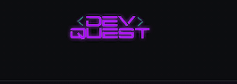

# Praticando README
um projeto de teste com um arquivo readme 

[](https://github.com/ArthurCastro99)

## Tecnologias em andamento
- HTML 
- CSS
- JS 

## FEEDBACK

1 - Clone do projeto
```
git clone <url>
```

2 - Olhe as pastas e edit oque você achar melhor '-'